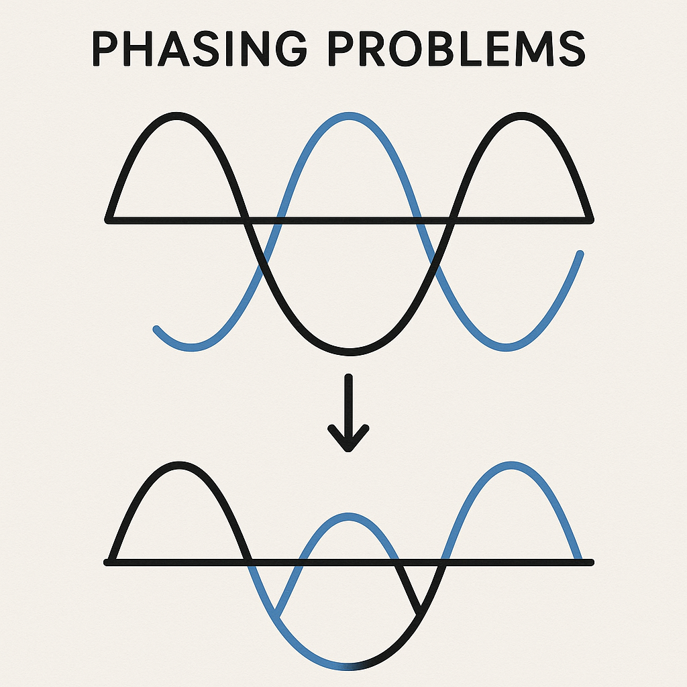

# Audio Phasing Issues
Phasing issues occur when two similar audio signals (usually from left and right stereo channels) are slightly delayed or out of phase with each other. This causes destructive interference - certain frequencies cancel out or sound hollow, especially when listening in mono.

This often happens due to:

 - Microphone misalignment during recording

 - Stereo effects with time delays

 - Mixing multiple takes without proper alignment

This tool analyzes stereo correlation and applies a minimal delay, mid/side processing, and a low-frequency cut on the side channel to reduce phasing artifacts and improve clarity.

## Visualization

## Further Explanations
https://www.youtube.com/watch?v=IrXHVWPGdeQ&t by **In The Mix**  
https://www.youtube.com/watch?v=4pXRFElqRaU by **Third Fret**
